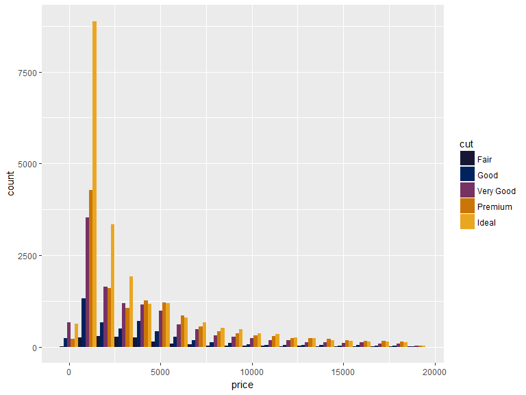

This is a direct replication of the code from [Karthik Ram's `wesanderson` palette](https://github.com/karthik/wesanderson) and [David Miller's `beyonce` palette](https://github.com/dill/beyonce)

But, I generated Colour Palettes using the wonderful and inspirational palettes from [colorlisa.com](http://www.colorlisa.com/)

Installation
------------

``` r
devtools::install_github("skiptoniam/artists")
```

Usage
-----

``` r
library(artists)
```

Here is a complete list of artworks and their colour palettes.

``` r
par(mfrow=c(26,5))
for(i in 1:128) print(artist_palette(i))
```


My only slight tweek is an abilitiy to view the art work your colour palette is based on. This can be achieved by setting `see_painting = TRUE`

This is one of my favorites

``` r
par(mfrow=c(2,1))
artist_palette(1,see_painting = TRUE)
```

    ## Adobe (Variant): Luminous Day by Josef Albers

``` r
library(jpeg)
```

    ## Warning: package 'jpeg' was built under R version 3.2.3

``` r
jj <- readJPEG('./a.jpg',native=TRUE)
plot(0:1,0:1,type="n",ann=FALSE,axes=FALSE)
rasterImage(jj,0,0,1,1)
```


I also really like this one too. Which seems to make nice plots.

``` r
par(mfrow=c(2,1))
artist_palette(3)
```

    ## Golden Cloud by Gretchen Albrecht

``` r
library(jpeg)
jj <- readJPEG('./b.jpg',native=TRUE)
plot(0:1,0:1,type="n",ann=FALSE,axes=FALSE)
rasterImage(jj,0,0,1,1)
```


Here is an example of using this colour palette in `ggplot`.

``` r
library(ggplot2)
```

    ## Warning: package 'ggplot2' was built under R version 3.2.5

``` r
ggplot(diamonds, aes(x = price, fill = cut)) +
  geom_histogram(position = "dodge", binwidth = 1000)+
  scale_fill_manual(values = artist_palette(3))
```


